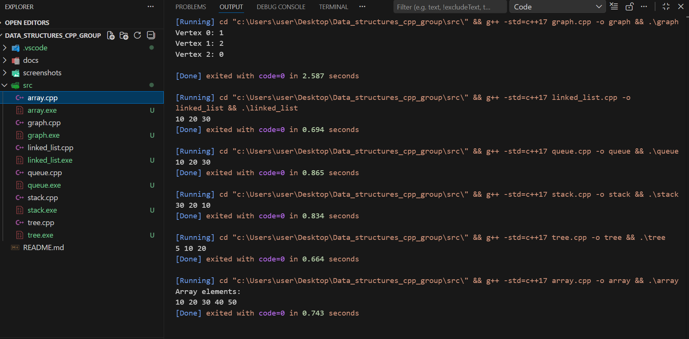

# Data Structures C++ Project
- This is a class group assignment on Data Structures.

# Assignment Description
TASK 1 - 2 weeks.

Using Notes 2 guide which is in VLMS, go to the section on  data Structure Classification.

- Using a programming language of your choice, in groups,  write code to represent each of the data structure classification and types.
- Research where the data structures types are applied and give reasons why.
- Give examples of applications that are using the data structure type and algorithm. Give reasons why
- Research how data structures and algorithms work within systems
- Put the codes in github as group
- Each person to upload individual github account in the vlms. Can be in a document.

## Group Members
 - JOSHUA SAMUEL       BSCCS/2025/40065
 - ARISTOTE ALPHONSE   BSCCS/2025/...
 - ROSEMARY MBUTHIA     BSCCS/2025/...
 - ALIER BIOR ALIER     BSCCS/2025/...

## Implemented Data Structures
- Array
- Linked List
- Stack
- Queue
- Tree
- Graph

## Research Document
[View Full Report](docs/Data_Structures_Report.docx)

## The Output Screenshot

